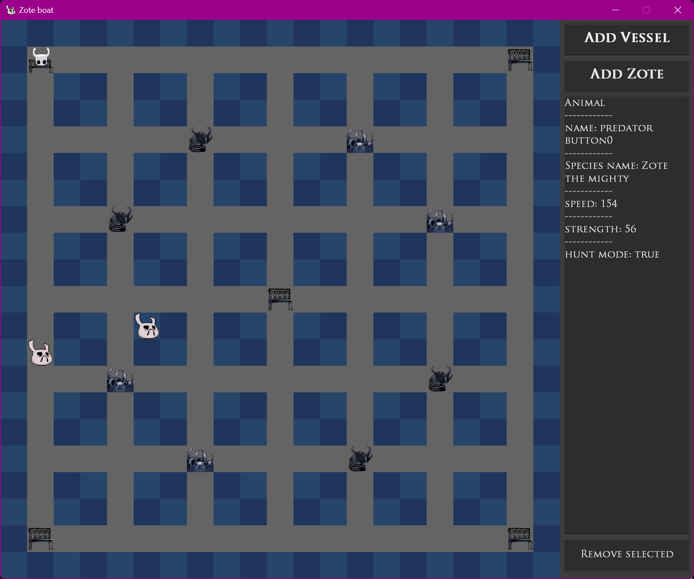

# Wildlife Simulator Project

## Description

The goal of this project is to create an immersive wildlife simulator. In this simulated world, various entities coexist, including predators, prey, plants, water sources, paths, and hideouts.

### Entities in the World

The world is inhabited by predators and prey. Each animal is characterized by a name, health, speed, strength, and species name. Predators, being generally stronger and faster than prey, play a crucial role in the ecosystem. Prey, on the other hand, depend on water sources and plants for sustenance.

### Behavioral Dynamics

- **Prey:** Prey animals have water and food levels. They need to eat and drink periodically, losing water and energy over time. When hungry or thirsty, prey select specific water/plant sources to travel to, utilizing paths between hideouts, water sources, and plants. After replenishing water and energy, prey return to their hideouts, where they can also reproduce.

- **Predators:** Predators roam freely without the constraints of paths. They actively hunt prey when spotted nearby. However, they cannot attack prey inside hideouts. A successful predator attack reduces the prey's health proportionally to the difference in strength between the predator and prey. If a prey loses all health before reaching a hideout, it dies and disappears from the hunting site. After a successful hunt, predators take a relaxation period.

### Environmental Components

- **Water Sources and Plants:** Each water source and plant is defined by a name, prey replenishing speed, and the maximum number of animals it can host. These elements contribute to the intricate balance of the simulated ecosystem.

**Note:**

- This wildlife simulator draws inspiration from the game Hollow Knight. Predators in this simulation are modeled after Zote the Mighty, preys after Vessels, and the environment is designed to match that of the Hollow Knight game.
- All art used in this project was created by Team Cherry. I do not hold any rights to the art assets.

## Preview

